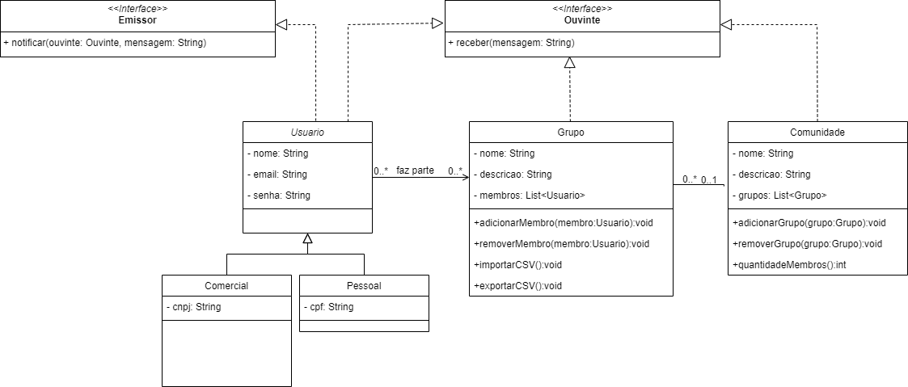

# Java, rede social
Trabalho avaliativo, final de trimestre da faculdade.

## Resumo
Criar uma rede social com a seguinte estrutura:

## Enunciado completo do projeto

Em uma rede social voltada para comunicação por mensagens, existe o conceito de usuários, grupos e comunidades:

Um usuário é uma pessoa ou um ente comercial, que pode receber ou enviar mensagens a outros usuários, grupos e comunidades.
Um grupo é um conjunto de usuários inseridos por afinidade de assunto ou propósito. 
Uma comunidade é um conjunto de grupos, juntos para melhor organização.
Um usuário pode fazer parte de vários grupos. Um grupo, por sua vez, faz parte, opcionalmente, de uma única comunidade.

Um usuário é considerado Ouvinte e Emissor de mensagens. Ou seja, ele pode enviar e receber mensagens. Grupos e comunidades são apenas Ouvintes e não podem enviar mensagens.

Quando um emissor (usuário) deseja enviar uma mensagem a um ouvinte (usuário, grupo ou comunidade) é necessário notificá-lo(s) por meio da chamada do método notificar. Assim sendo:

Se uma mensagem é enviada um usuário, somente o usuário ouvinte recebe a mensagem;
Se uma mensagem é enviada diretamente a um grupo, todos os membros do grupo recebem a mensagem;
Quando uma mensagem é enviada a uma comunidade, todos os membros de todos os grupos pertencentes a uma comunidade recebem a mensagem.
Considere, portanto, o seguinte diagrama de classes que modela parcialmente e de maneira simplificada o domínio de problema proposto:

Agora, você deve preparar o projeto: 

1. Crie um projeto na IDE IntelliJ;
2. Crie as classes e interfaces dessa avaliação em arquivos separados;
3. Crie uma pasta chamada “output” na raiz do projeto para guardar os logs produzidos pelo programa;
4. Crie uma pasta chamada “prints” na raiz do projeto para guardar os “prints” solicitados;

Posteriormente, implemente:

5. A interface Emissor, que possui um método notificar, que deve ser implementado pela classe Usuario; a interface Ouvinte, que possui um método receber, que deve ser implementado pelas classes Usuario, Grupo e Comunidade;
6. As classes Usuario, Pessoal, Comercial, Grupo e Comunidade, com seus respectivos atributos. 
7. A classe Grupo possui um atributo que mapeia a associação "muitos" com a classe Usuario. É necessário criar dois métodos para adicionar ou remover um membro (usuário). O mesmo acontece na classe Comunidade e sua relação com a classe Grupo;
8. Na classe Comunidade, o método quantidadeMembros retorna o somatório total de usuários existentes, excluindo eventuais repetições em grupos distintos;
9. Nas classes Grupo e Comunidade, o atributo do tipo List deve ser instanciado dentro de seus respectivos construtores, que não devem possuir parâmetros. Em todas as outras classes, crie um construtor parametrizado para todos os atributos;
10. Os atributos de todas as classes devem ser encapsulados (getters e setters);
11. Estabeleça a herança entre Usuario, Pessoal e Comercial.
12. Na classe Usuario, implemente o método notificar, que simplesmente invoca o método receber do objeto Ouvinte, repassando o parâmetro do tipo String fornecido (mensagem). Ainda nessa classe, implemente o método receber, que simplesmente imprime na tela o valor do parâmetro mensagem passado; na classe Grupo, implemente o método receber, que percorre lista de membros e invoca o método receber de cada usuário participante; já na classe Comunidade, o método receber deve percorrer a lista de grupos, invocando o método receber de cada grupo participante.
<u>Não importa se um membro receber a mesma mensagem mais de uma vez (caso ele faça parte de mais de um grupo).</u>

13. Ainda dentro do método notificar, faça um log em arquivo de texto plano com a mensagem enviada. O log deve conter: data-hora, nome do emissor, nome do receptor e o texto da mensagem. Dica: sobrescreva o método toString nas classes que implementam as interfaces Ouvinte e Emissor. Isso vai facilitar a criação do log. O registro em log (arquivo texto) deve ser feito sem o uso de frameworks.
14. Crie uma classe chamada UsuarioExcecao que possui métodos para lançamento de erros relativos aos atributos da classe Usuario. Deve existir um método para lançar uma exceção para cada atributo, considerando que nome, e-mail e senha não podem ser vazios ou nulos. Utilize essa classe nos métodos setters da classe Usuario;
15. Implemente o método chamado exportarParaCSV dentro da classe Grupo. Esse método deverá criar um arquivo de texto na pasta “output”. O arquivo deverá ter o mesmo nome do grupo que sofreu o processo de exportação. Cada linha do arquivo deverá ter todos os atributos de cada membro pertencente a esse grupo.
16. Implemente o método chamado importarDeCSV dentro da classe Grupo. Esse método deverá ler de um arquivo de texto na pasta “output”. O arquivo deverá ter o mesmo nome do grupo que sofreu o processo de exportação anteriormente. O grupo será criado com os membros existentes no arquivo. 
17. Crie uma classe chamada Principal. No método main, faça:
a. Crie o objeto usuario1 com os seguintes dados para o nome, e-mail, senha e cpf: "Elian", "elian@javeiros.com","123", “999.999.999-99”;
b. Crie o objeto usuario2 com os seguintes dados para o nome, e-mail, senha e cpf: "Ana Amélia", "ana.amelia@javeiros.com","123", “888.888.888-88”;
c. Crie o objeto usuario3 com os seguintes dados para o nome, e-mail, senha e cpf: "José Neto", "jose.neto@javeiros.com","123", “777.777.777-77”;
d. Crie o objeto usuario4 com dados lidos a partir do teclado; 
e. Crie o objeto grupo1 com os seguintes dados para o nome e descrição: "Javeiros, guerreiros, destruidores", "Javeiros de corpo e alma";
f. Crie o objeto grupo2 com os seguintes dados para o nome e descrição: "C raiz", "Por que qualquer outra coisa é overhead";
18. Ainda no método main, faça:
a. Adicione usuario1 e usuario2 ao grupo1;
b. Adicione usuario1 e usuario3 ao grupo2;
c. Crie uma comunidade chamada "Programadores do Iraque", cuja descrição é "Programadores nascidos e criados em Irajá."; e
d. Adicione os grupos 1 e 2 a essa comunidade recém-criada.
19. Ainda no método main, faça:
a. O usuario1 deve enviar uma mensagem a comunidade "Programadores do Iraque" com o seguinte texto: "Salve, salve, galera!". O log deverá estar salvo em uma pasta chamada output, que por sua vez deverá estar na raiz do projeto;
b. Os grupos 1 e 2 devem ter seus dados exportados para um arquivo no formato CSV;
c. Imprima a quantidade de membros existentes na comunidade. Faça um print da tela e coloque na pasta “prints”.

# Java, social network
Assessment work, end of college trimester.

## Project Summary
Create a social network with the following structure:

Complete Project Statement
In a message-oriented social network, there are users, groups, and communities:

A user can send or receive messages from other users, groups, and communities.
A group consists of users grouped by shared interests or purposes.
A community is a collection of groups, organized for better management.
Users can belong to multiple groups. A group, optionally, belongs to a single community.
A user acts as both a message sender and receiver. Groups and communities only receive messages and cannot send them.

When a sender (user) wants to send a message to a receiver (user, group, or community), they must notify them through the notify method:

If a message is sent to a user, only the user receives it.
If a message is sent to a group, all group members receive it.
If a message is sent to a community, all members of all groups within the community receive it.
Consider the following class diagram that partially and simplistically models the problem domain:

Now, prepare the project:

1. Create a project in the IntelliJ IDE.
2. Create the necessary classes and interfaces in separate files.
3. Create a folder named "output" at the root of the project to store program logs.
4. Create a folder named "prints" at the root of the project to store requested prints.

Next, implement:

5. The Emissor interface, which includes a notify method, to be implemented by the Usuario class; the Ouvinte interface, which includes a receber method, to be implemented by the Usuario, Grupo, and Comunidade classes.
6. The Usuario, Pessoal, Comercial, Grupo, and Comunidade classes with their respective attributes.
7. The Grupo class should have an attribute mapping the "many" association with the Usuario class. Implement methods to add or remove a member (user). Similarly, implement this for the Comunidade class and its relationship with the Grupo class.
8. In the Comunidade class, the quantidadeMembros method should return the total number of unique users across all groups.
9. Instantiate the List attribute within the constructors of the Grupo and Comunidade classes, which should not take parameters. All other classes should have a parameterized constructor.
10. Encapsulate the attributes of all classes (create getters and setters).
11. Establish inheritance between Usuario, Pessoal, and Comercial.
12. Implement the notificar method in the Usuario class, which simply invokes the receber method of the Ouvinte object, passing the provided mensagem parameter. Also, implement the receber method in the Usuario class, which prints the mensagem parameter value to the screen; in the Grupo class, implement the receber method, which iterates through the list of members and invokes the receber method for each participating user; in the Comunidade class, the receber method should iterate through the list of groups and invoke the receber method for each participating group.
<u>It doesn't matter if a member receives the same message more than once (if they belong to more than one group).</u>

13. Within the notificar method, log the message to a plain text file. The log should include: date-time, sender's name, receiver's name, and the message text. Hint: Override the toString method in classes implementing the Ouvinte and Emissor interfaces to facilitate logging. Text file logging should be done without using frameworks.
14. Create a class called UsuarioExcecao with methods to throw errors related to Usuario class attributes. There should be a method to throw an exception for each attribute, considering that nome, email, and senha cannot be empty or null. Utilize this class in the setters of the Usuario class.
15. Implement a method named exportarParaCSV in the Grupo class. This method should create a text file in the "output" folder. The file should be named after the group that undergoes the export process. Each line in the file should contain all attributes of each member belonging to that group.
16. Implement a method named importarDeCSV in the Grupo class. This method should read from a text file in the "output" folder. The file should have the same name as the previously exported group. The group will be created with the members existing in the file.
17. Create a class named Principal. In the main method:
    a. Create usuario1 with the following data for name, email, senha, and cpf: "Elian", "elian@javeiros.com","123", "999.999.999-99";
    b. Create usuario2 with the following data for name, email, senha, and cpf: "Ana Amélia", "ana.amelia@javeiros.com","123", "888.888.888-88";
    c. Create usuario3 with the following data for name, email, senha, and cpf: "José Neto", "jose.neto@javeiros.com","123", "777.777.777-77";
    d. Create usuario4 with data read from the keyboard;
    e. Create grupo1 with the following data for name and description: "Javeiros, guerreiros, destruidores", "Javeiros de corpo e alma";
    f. Create grupo2 with the following data for name and description: "C raiz", "Por que qualquer outra coisa é overhead";
18. Also in the main method:
    a. Add usuario1 and usuario2 to grupo1;
    b. Add usuario1 and usuario3 to grupo2;
    c. Create a community named "Programadores do Iraque" with the description "Programadores nascidos e criados em Irajá.";
    d. Add grupo1 and grupo2 to this newly created community.
19. Still in the main method:
    a. usuario1 should send a message to the "Programadores do Iraque" community with the following text: "Salve, salve, galera!". The log should be saved in a folder named "output", which should be in the project root.
    b. grupo1 and grupo2 should have their data exported to a CSV format file.
    c. Print the quantity of members in the community to the screen and place it in the "prints" folder.